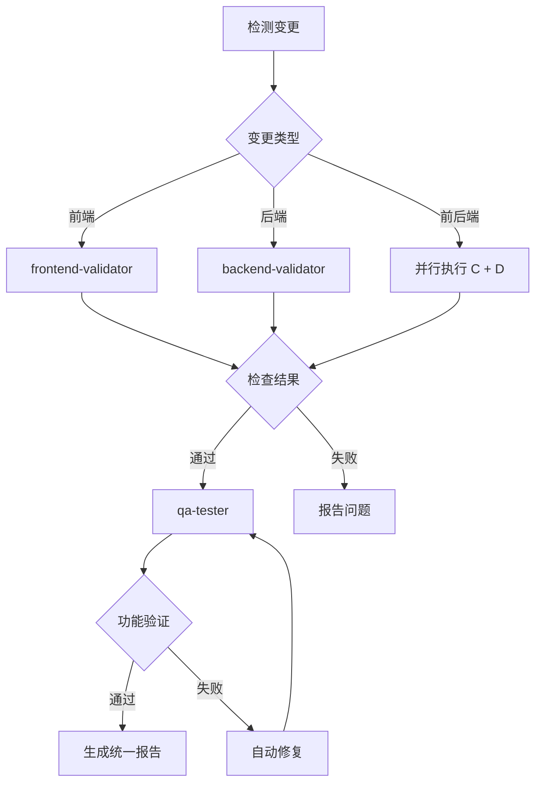
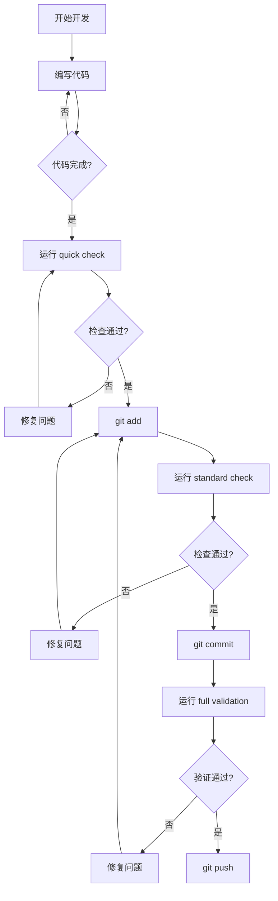

# AI 生成代码全流程测试验证 Skill 分析与优化方案

## 文档信息

| 项目 | 内容 |
|------|------|
| 创建日期 | 2026-06-10 |
| 版本 | v1.0 |
| 目标 | 分析 frontend-validator、backend-validator、qa-tester 三个 skill 的能力，识别缺口，制定优化方案 |

---

## 第一部分：三个 Skill 职责定位与功能范围分析

### 1.1 Frontend Validator

#### 职责定位
**专注于前端代码质量验证**，在代码提交前捕获静态分析错误、类型问题和构建失败。

#### 功能范围

| 检查类别 | 检查项 | 阻塞级别 |
|----------|--------|----------|
| **Type Checking** | TypeScript 类型检查 | 阻塞 |
| **Lint** | ESLint 规则检查 | 阻塞 |
| **Format** | Prettier 格式化 | 阻塞 |
| **Unit Tests** | 单元测试执行 | 阻塞 |
| **i18n Parity** | 国际化 key 一致性 | 警告 |
| **Hardcoded Strings** | 硬编码中文检测 | 警告 |
| **Test Coverage** | 测试覆盖率 | 警告 |
| **Build** | 生产构建验证 | 阻塞 |
| **Impact Analysis** | GitNexus 影响分析 | 信息 |

#### 验证级别

| 级别 | 检查内容 | 预计耗时 |
|------|----------|----------|
| **quick** | TypeCheck + Lint + Format + 受影响的单元测试 | 1-2 min |
| **standard** | Quick + 扩展检查 + Build + GitNexus 影响分析 | 3-5 min |
| **full** | Standard + 完整单元测试套件 | 5-8 min |

#### 检测范围

```bash
# 检测未暂存更改
git diff --name-only HEAD -- frontend/

# 检测已暂存更改
git diff --name-only --cached -- frontend/
```

**文件过滤**：只检测 `.ts`, `.tsx`, `.js`, `.jsx`, `.css` 文件，排除 `.md`, `.json`, `pnpm-lock.yaml`

#### 使用建议

| 场景 | 推荐级别 | 触发命令 |
|------|----------|----------|
| 开发中快速反馈 | quick | "quick check", "快速检查" |
| 日常开发验证 | standard | "check", "validate", "检查改动" |
| 提交前完整验证 | full | "full check", "完整检查", "before PR" |

#### 关键限制

- **不负责**：E2E 测试、功能验证（由 qa-tester 负责）
- **不负责**：后端代码验证（由 backend-validator 负责）
- **GitNexus 局限**：主要索引后端 Python 代码，前端 TS/TSX 可能无法找到符号

---

### 1.2 Backend Validator

#### 职责定位
**专注于后端 Python 代码质量验证**，包含测试缺口分析、测试编写和全面的静态分析。

#### 功能范围

| Phase | 名称 | 功能 | 独立触发 |
|-------|------|------|----------|
| **Phase 0** | Pre-flight Checks | Git 状态、依赖、配置、迁移检查 | "preflight", "预检" |
| **Phase 1** | Test Gap Analysis | 分析测试缺口并编写测试 | "write tests", "分析测试缺口" |
| **Phase 2** | Validate Changes | Lint、格式化、测试、阻塞IO、影响分析 | "check", "validate", "检查改动" |

#### 验证级别

| 级别 | 检查内容 | 预计耗时 |
|------|----------|----------|
| **quick** | Phase 0 + Lint + Format + 受影响测试 | 1-2 min |
| **standard** | Phase 0 + Lint + Format + 完整测试 + 阻塞IO + 静态分析 + 影响分析 | 3-5 min |
| **full** | Phase 0 + Phase 1 + Phase 2 + PR 就绪度评分 | 10+ min |

#### Phase 0：Pre-flight Checks

| 检查项 | 内容 | 阻塞级别 |
|--------|------|----------|
| Git Workspace | 未提交文件数量统计 | 警告 |
| Branch Info | 分支信息、与 main 的差异 | 信息 |
| Dependency | pyproject.toml 与 .venv 的时间对比 | 警告 |
| Config Validation | YAML/JSON 语法检查 | 警告 |
| Config Semantic | 代码引用的配置键是否存在于 config.yaml | 警告 |
| Migration Status | Alembic 迁移状态 | 警告 |
| Model-Migration | 模型文件变更与迁移一致性检查 | 警告 |
| Dependency Security | pip-audit 依赖漏洞检查 | 警告 |
| Static Security | bandit 静态安全扫描 | 警告 |

**关键特性**：Pre-flight 永不阻塞，仅提供警告信息。

#### Phase 1：Test Gap Analysis & Authoring

**分析流程**：
1. 使用 GitNexus `detect_changes` 检测变更符号
2. 使用 GitNexus `query` 查找测试覆盖
3. 使用 GitNexus `context` 理解符号契约
4. 识别测试缺口并报告

**测试编写规范**：
- 测试文件位置：`backend/tests/`
- 命名规范：`test_<module_name>.py`
- 使用 class-based 分组
- 使用 `unittest.mock` 系列
- 遵循项目 fixtures（`_auto_user_context`, `_router_auth_helpers`）

#### Phase 2：Validate Changes

| 检查项 | 命令 | 阻塞级别 |
|--------|------|----------|
| Lint | `uvx ruff check .` | 阻塞 |
| Format | `uvx ruff format --check .` | 阻塞 |
| Unit Tests | `make test` | 阻塞 |
| Blocking IO Regression | `make test-blocking-io` | 阻塞 |
| Static Blocking IO | `make detect-blocking-io` | 阻塞 |
| Thread Boundaries | `make detect-thread-boundaries` | 阻塞 |
| Dependency Security | `uv run pip-audit` | 警告 |
| Static Security (SAST) | `uv run bandit -r packages/` | 警告 |
| Route Change Detection | `git diff -- routers/` | 警告 |
| Impact Analysis | GitNexus | 信息 |

#### 使用建议

| 场景 | 推荐级别 | 触发命令 |
|------|----------|----------|
| 开发中快速反馈 | quick | "quick check", "快速检查" |
| 日常开发验证 | standard | "check", "validate", "检查改动" |
| 提交前完整验证 | full | "full check", "完整检查", "pre-commit" |
| 分析测试缺口 | - | "write tests", "分析测试缺口" |
| 仅报告缺口 | - | "analyze gaps", "分析缺口" |

#### 关键限制

- **不负责**：E2E 验证、交叉验证（API 契约、数据库迁移、配置文件）——由 qa-tester 负责
- **GitNexus 优势**：原生索引后端 Python 代码，影响分析效果好

---

### 1.3 QA Tester

#### 职责定位
**像人类测试员一样验证整个应用功能**，通过 API 测试后端功能，通过 Playwright 浏览器自动化测试前端页面。

#### 功能范围

| Phase | 名称 | quick | standard | full |
|-------|------|:-----:|:--------:|:----:|
| **Phase 0** | Pre-flight（环境检查、服务启动） | ✅ | ✅ | ✅ |
| **Phase 0.5** | 变更检测（智能测试范围选择） | ✅ | ✅ | ✅ |
| **Phase 1** | API 测试（后端端点功能验证） | 核心 | 全部/变更感知 | 全部 |
| **Phase 2** | E2E 测试（Playwright 浏览器自动化） | ❌ | 关键流程 | 全部 + Firefox |
| **Phase 3** | 集成验证（API 契约、数据库迁移、配置文件） | ❌ | API 契约 | 全部 |
| **Phase 3.5** | 性能基准（API 响应时间基准测试） | ❌ | ❌ | ✅ |
| **Phase 3.6** | 部署前验证（构建产物、模块完整性） | ❌ | ❌ | ✅ |
| **Phase 4** | 修复（自动修复 + 回归验证） | ❌ | ❌ | ✅ |

#### 验证级别

| 级别 | 预计耗时 | 触发命令 |
|------|----------|----------|
| **quick** | ~3 min | "quick test", "快速测试" |
| **standard** | ~10 min | "test", "测试", "qa test" |
| **full** | ~20 min | "full test", "完整测试" |

#### Phase 0：Pre-flight Checks

| 检查项 | 内容 |
|--------|------|
| Backend Status | 检查后端是否运行 (localhost:8001) |
| Frontend Status | 检查前端是否运行 (localhost:3000) |
| Database | 数据库文件、Alembic 迁移状态 |
| Test User | 管理员用户初始化、认证 token |
| Playwright | Playwright 安装、Chromium 浏览器 |

#### Phase 1：API 端点测试

**测试范围**（standard/full 级别）：

| 模块 | 端点 | 测试内容 |
|------|------|----------|
| Auth | setup-status, login, register, change-password, logout | 完整认证流程 |
| Threads | search, create, get, update metadata, delete | 线程生命周期 |
| Agents | list, create, get, update, delete, check-name, export/import | Agent CRUD |
| Workflows | list, create, get, update, delete, run, review | 工作流 CRUD |
| Skills | list, get, enable/disable, install | 技能管理 |
| Tools | list, test | 工具发现 |
| Admin | stats, users CRUD, departments CRUD | RBAC、用户管理 |
| Memory | load, create fact, update, delete, clear | 记忆 CRUD |
| Uploads | upload, list, delete | 文件上传 |
| MCP Config | get, update | MCP 配置 |

**执行脚本**：`.claude/skills/qa-tester/scripts/run_api_tests.sh`

#### Phase 2：Playwright E2E 测试

**测试流程**（standard 级别）：

| 流程 | 优先级 | 测试步骤 |
|------|--------|----------|
| 首次设置 | P0 | 访问 / → 重定向到 /setup → 创建管理员 → 进入 workspace |
| 登录/登出 | P0 | 访问 /login → 输入凭据 → 验证跳转 → 登出 |
| 聊天 | P0 | 新建聊天 → 发送消息 → 验证响应 → 导出 |
| Agent 管理 | P1 | 浏览 → 创建 → 编辑 → 删除 |
| 工作流 | P1 | 浏览 → 创建 → 运行 → 查看状态 |
| 管理面板 | P1 | 查看统计 → 管理用户/部门 |

**测试生成规则**：
- 每个用户流程一个测试文件
- 使用 `data-testid` 或语义化选择器
- 复用 `mockLangGraphAPI` mock 后端响应
- 每个测试独立，可单独运行

#### Phase 3：集成验证

| 验证项 | 内容 | 级别 |
|--------|------|------|
| API 契约 | 后端路由与前端消费者兼容性检查 | standard+ |
| 数据库迁移 | 迁移语法、升级、回滚验证 | full |
| 配置文件深度验证 | 配置键匹配、示例配置完整性 | full |

#### Phase 4：自动修复（full 级别）

**修复策略**：

| 问题类型 | 修复策略 |
|----------|----------|
| API 返回错误状态码 | 检查路由代码，修复业务逻辑 |
| 页面元素缺失/不可见 | 检查组件代码，修复渲染逻辑 |
| 表单验证错误 | 检查验证逻辑，修复规则 |
| 权限/认证问题 | 检查 RBAC 配置，修复权限检查 |
| 超时/性能问题 | 报告但不自动修复 |
| 样式/布局问题 | 报告但不自动修复 |

#### 使用建议

| 场景 | 推荐级别 | 触发命令 |
|------|----------|----------|
| 最小化验证 | quick | "smoke test", "冒烟测试" |
| 日常功能验证 | standard | "test", "测试", "qa test" |
| 完整验证 + 自动修复 | full | "full test", "完整测试" |
| 仅测试认证 | standard | "test auth", "测试登录" |
| 仅测试 Agent | standard | "test agent", "测试 agent" |
| 仅测试 Workflow | standard | "test workflow", "测试工作流" |
| 交叉验证 | standard | "cross check", "交叉验证" |
| 跨浏览器测试 | full | "cross browser", "跨浏览器" |

#### 关键限制

- **不负责**：代码质量检查（用 frontend-validator / backend-validator）
- **需要运行服务**：依赖后端 (8001) 和前端 (3000) 服务
- **语言支持**：支持中英文，根据用户输入语言自动切换报告语言

---

## 第二部分：AI 生成代码全流程测试验证需求分析

### 2.1 AI 生成代码的测试验证挑战

AI 生成的代码与人工编写的代码相比，有以下特点：

| 特点 | 测试验证挑战 |
|------|--------------|
| 语法正确但逻辑可能有误 | 需要功能测试验证 |
| 可能引入隐蔽的安全漏洞 | 需要安全扫描 |
| 可能不符合项目规范 | 需要代码风格检查 |
| 可能破坏现有功能 | 需要回归测试 |
| 可能遗漏边界情况 | 需要边界测试 |
| 可能引入性能问题 | 需要性能测试 |

### 2.2 全流程测试验证环节

#### 阶段 1：代码生成后（未暂存状态）

| 测试类型 | 目的 | 当前支持 |
|----------|------|----------|
| **静态类型检查** | 捕获类型错误 | ✅ frontend-validator, backend-validator |
| **代码风格检查** | 确保符合项目规范 | ✅ frontend-validator, backend-validator |
| **代码格式化** | 统一代码风格 | ✅ frontend-validator, backend-validator |
| **单元测试** | 验证函数/方法正确性 | ✅ frontend-validator, backend-validator |
| **测试覆盖率** | 确保测试充分 | ⚠️ frontend-validator (警告), backend-validator (Phase 1) |

#### 阶段 2：代码暂存后（已暂存状态）

| 测试类型 | 目的 | 当前支持 |
|----------|------|----------|
| **构建验证** | 确保代码可编译 | ✅ frontend-validator |
| **完整测试套件** | 运行所有测试 | ✅ frontend-validator, backend-validator |
| **阻塞IO检测** | 检测异步代码中的阻塞调用 | ✅ backend-validator |
| **线程边界分析** | 检测线程安全问题 | ✅ backend-validator |
| **影响分析** | 评估变更影响范围 | ✅ frontend-validator, backend-validator (GitNexus) |

#### 阶段 3：代码提交后

| 测试类型 | 目的 | 当前支持 |
|----------|------|----------|
| **API 功能测试** | 验证端点功能正确性 | ✅ qa-tester (Phase 1) |
| **E2E 测试** | 验证用户流程 | ✅ qa-tester (Phase 2) |
| **API 契约验证** | 前后端一致性 | ✅ qa-tester (Phase 3) |
| **数据库迁移验证** | 迁移正确性和可回滚性 | ✅ qa-tester (Phase 3) |
| **配置文件验证** | 配置完整性 | ✅ qa-tester (Phase 3) |

#### 阶段 4：部署前

| 测试类型 | 目的 | 当前支持 |
|----------|------|----------|
| **安全扫描** | 检测安全漏洞 | ❌ 缺失 |
| **性能测试** | 验证性能指标 | ❌ 缺失 |
| **兼容性测试** | 浏览器/环境兼容性 | ⚠️ 部分 (Playwright Chromium) |
| **回归测试** | 确保现有功能不受影响 | ✅ qa-tester |

#### 阶段 5：部署后

| 测试类型 | 目的 | 当前支持 |
|----------|------|----------|
| **冒烟测试** | 验证部署成功 | ✅ qa-tester (quick) |
| **健康检查** | 服务可用性验证 | ✅ qa-tester (Phase 0) |
| **监控告警** | 生产环境监控 | ❌ 缺失 |

---

## 第三部分：当前三个 Skill 的能力缺口分析

### 3.1 检测范围缺口

#### 3.1.1 Git 变更检测

| 缺口 | 描述 | 影响 |
|------|------|------|
| **未暂存更改检测** | frontend-validator 和 backend-validator 都检测未暂存更改，但 qa-tester 不主动检测 | qa-tester 可能测试过时代码 |
| **暂存未提交更改检测** | 三个 skill 都支持，但没有统一的变更追踪机制 | 无法确保测试覆盖所有变更 |
| **提交后变更检测** | qa-tester 依赖服务运行，不直接检测 git 变更 | 可能遗漏未部署的变更 |

#### 3.1.2 代码范围检测

| 缺口 | 描述 | 影响 |
|------|------|------|
| **配置文件变更** | 只检查语法，不验证语义正确性 | 配置错误可能在运行时才发现 |
| **依赖变更** | 只检查 pyproject.toml 时间，不验证依赖兼容性 | 依赖冲突可能在运行时才发现 |
| **数据库模型变更** | 只检查迁移文件，不验证数据兼容性 | 数据丢失风险 |
| **前端路由变更** | 不检测前端路由配置变更 | 页面 404 错误 |

### 3.2 测试类型缺口

#### 3.2.1 静态分析缺口

| 缺口 | 描述 | 优先级 |
|------|------|--------|
| **安全扫描** | 无 SAST（静态应用安全测试）工具 | HIGH |
| **依赖漏洞扫描** | 无依赖安全检查 | HIGH |
| **代码复杂度分析** | 无圈复杂度、认知复杂度检查 | MEDIUM |
| **死代码检测** | 无未使用代码检测 | LOW |

#### 3.2.2 动态测试缺口

| 缺口 | 描述 | 优先级 |
|------|------|--------|
| **性能测试** | 无负载测试、压力测试 | HIGH |
| **内存泄漏检测** | 无内存使用监控 | MEDIUM |
| **并发测试** | 无并发访问测试 | MEDIUM |
| **容错测试** | 无故障注入测试 | LOW |

#### 3.2.3 集成测试缺口

| 缺口 | 描述 | 优先级 |
|------|------|--------|
| **跨浏览器测试** | 只测试 Chromium，未覆盖 Firefox/Safari | MEDIUM |
| **移动端测试** | 无移动端专项测试 | LOW |
| **API 版本兼容** | 无 API 版本管理测试 | LOW |

### 3.3 工作流缺口

#### 3.3.1 变更阶段覆盖

| 阶段 | 当前覆盖 | 缺口 |
|------|----------|------|
| 未暂存更改 | ✅ frontend-validator, backend-validator | qa-tester 不检测 |
| 暂存未提交更改 | ✅ 三个 skill 都支持 | 无统一追踪 |
| 提交后更改 | ⚠️ qa-tester 依赖服务运行 | 无 git 层面验证 |
| 部署后验证 | ✅ qa-tester (Phase 0) | 无生产环境验证 |

#### 3.3.2 Skill 协作缺口

| 缺口 | 描述 | 影响 |
|------|------|------|
| **无统一入口** | 三个 skill 独立运行，无统一编排 | 用户需要手动触发多个 skill |
| **无结果聚合** | 各 skill 报告独立，无统一汇总 | 难以快速了解整体状态 |
| **无依赖管理** | skill 之间无显式依赖关系 | 可能在前置条件未满足时运行 |
| **无自动触发** | 需要用户手动触发 | 可能遗漏验证步骤 |

### 3.4 报告和反馈缺口

| 缺口 | 描述 | 影响 |
|------|------|------|
| **无统一报告格式** | 三个 skill 报告格式不同 | 难以比较和聚合 |
| **无历史追踪** | 无验证历史记录 | 无法追踪质量趋势 |
| **无修复建议优先级** | 建议无优先级排序 | 用户可能先修复低优先级问题 |
| **无自动修复** | 只有 qa-tester (full) 支持自动修复 | 修复效率低 |

---

## 第四部分：优化方案

### 4.1 优化目标

1. **全覆盖**：确保 AI 生成代码从生成到部署的所有阶段都有测试验证
2. **全检测**：确保未暂存、暂存未提交、提交后等各阶段变更都能被检测和验证
3. **全协作**：三个 skill 能够无缝协作，提供统一的验证体验
4. **全报告**：提供统一、清晰、可操作的验证报告

### 4.2 优化方案架构

```
┌─────────────────────────────────────────────────────────────┐
│                    Unified Validation Orchestrator           │
│                    (新增：validation-orchestrator skill)      │
├─────────────────────────────────────────────────────────────┤
│                                                             │
│  ┌─────────────┐  ┌─────────────┐  ┌─────────────┐        │
│  │  Frontend    │  │   Backend   │  │   QA        │        │
│  │  Validator   │  │   Validator │  │   Tester    │        │
│  │  (增强)      │  │   (增强)    │  │   (增强)    │        │
│  └──────┬──────┘  └──────┬──────┘  └──────┬──────┘        │
│         │                │                │                │
│         └────────────────┼────────────────┘                │
│                          │                                 │
│                    ┌─────▼─────┐                           │
│                    │  Unified  │                           │
│                    │  Reporter │                           │
│                    └───────────┘                           │
│                                                             │
└─────────────────────────────────────────────────────────────┘
```

### 4.3 具体优化措施

#### 4.3.1 新增：validation-orchestrator Skill

**职责**：统一编排三个验证 skill，提供一站式验证体验。

**功能**：

```yaml
name: validation-orchestrator
description: |
  统一验证编排器 — 编排 frontend-validator、backend-validator、qa-tester 三个 skill。
  触发条件: "validate all", "full validation", "全面验证", "pre-commit", "pre-deploy"
```

**工作流程**：



#### 4.3.2 增强：Frontend Validator

**新增功能**：

1. **安全扫描集成**
   ```bash
   # 添加 ESLint 安全规则
   pnpm lint:security
   ```

2. **依赖漏洞检查**
   ```bash
   # 使用 npm audit 或 snyk
   pnpm audit
   ```

3. **前端路由变更检测**
   ```bash
   # 检测 app/ 目录下的路由变更
   git diff --name-only HEAD -- frontend/src/app/
   ```

4. **组件影响分析**
   ```bash
   # 分析组件被哪些页面使用
   grep -r "import.*ComponentName" frontend/src/ --include="*.tsx"
   ```

**增强检测范围**：

```bash
# 当前：只检测 frontend/ 目录
git diff --name-only HEAD -- frontend/

# 增强：检测前端相关配置文件
git diff --name-only HEAD -- frontend/ .github/workflows/frontend-*.yml
```

#### 4.3.3 增强：Backend Validator

**新增功能**：

1. **安全扫描集成**
   ```bash
   # 使用 bandit 进行安全扫描
   uv run bandit -r backend/packages/ -f json -o .ideer/bandit-report.json
   ```

2. **依赖漏洞检查**
   ```bash
   # 使用 safety 或 pip-audit
   uv run pip-audit
   ```

3. **数据库模型变更验证**
   ```bash
   # 检测模型文件变更
   git diff --name-only HEAD -- backend/packages/harness/ideer/persistence/models/
   
   # 验证模型与迁移一致性
   PYTHONPATH=. alembic check
   ```

4. **API 路由变更检测**
   ```bash
   # 检测路由文件变更
   git diff --name-only HEAD -- backend/app/gateway/routers/
   
   # 提取变更的路由定义
   git diff HEAD -- backend/app/gateway/routers/ | grep "^[+-].*router\.\(get\|post\|put\|delete\)"
   ```

**增强 Phase 0**：

```python
# Step 0.6: Security Scan
def check_security():
    """运行安全扫描"""
    # bandit 扫描
    result = subprocess.run(['uv', 'run', 'bandit', '-r', 'backend/packages/', '-f', 'json'])
    return result.returncode == 0
```

#### 4.3.4 增强：QA Tester

**新增功能**：

1. **变更感知测试**
   ```bash
   # 检测未暂存更改
   git diff --name-only HEAD
   
   # 只测试受影响的模块
   if git diff --name-only HEAD | grep -q "backend/app/gateway/routers/auth.py"; then
       test_endpoint "Auth"
   fi
   ```

2. **部署前验证**
   ```bash
   # 验证构建产物
   ls -la frontend/out/ || ls -la frontend/.next/
   
   # 验证 Docker 镜像
   docker images | grep ideer
   ```

3. **性能基准测试**
   ```bash
   # API 响应时间基准
   time curl -s http://localhost:8001/api/v1/auth/me
   ```

4. **跨浏览器测试**
   ```bash
   # 多浏览器 E2E 测试
   npx playwright test --project=chromium --project=firefox
   ```

**增强 Phase 3**：

```bash
# Step 3.5: 性能基准验证
test_performance_baseline() {
    # 测试关键 API 响应时间
    local endpoints=("/api/v1/auth/me" "/api/threads" "/api/agents")
    for endpoint in "${endpoints[@]}"; do
        local response_time=$(curl -s -o /dev/null -w "%{time_total}" "http://localhost:8001$endpoint")
        if (( $(echo "$response_time > 1.0" | bc -l) )); then
            echo "⚠️ $endpoint 响应时间过长: ${response_time}s"
        fi
    done
}
```

### 4.4 统一报告格式

#### 报告结构

```markdown
# 统一验证报告
**时间**: 2026-06-10 14:30:00
**级别**: standard
**耗时**: 8m 30s
**变更文件**: 15 (前端: 8, 后端: 7)

## 概要
✅ 可以提交 / ❌ 暂时不能提交 / ⚠️ 建议检查

## 变更检测
| 阶段 | 文件数 | 状态 |
|------|--------|------|
| 未暂存 | 5 | ✅ 已验证 |
| 已暂存 | 10 | ✅ 已验证 |
| 已提交 | 0 | - |

## 验证结果

### 代码质量
| 检查项 | Frontend | Backend | 状态 |
|--------|----------|---------|------|
| 类型检查 | ✅ | ✅ | 通过 |
| Lint | ✅ | ⚠️ 2 warnings | 警告 |
| 格式化 | ✅ | ✅ | 通过 |
| 安全扫描 | ✅ | ✅ | 通过 |

### 测试覆盖
| 测试类型 | Frontend | Backend | 状态 |
|----------|----------|---------|------|
| 单元测试 | 135 pass | 98 pass | 通过 |
| E2E 测试 | 8/8 pass | - | 通过 |
| API 测试 | - | 45/45 pass | 通过 |

### 影响分析
| 维度 | 风险等级 | 详情 |
|------|----------|------|
| 前端 | LOW | 3 个组件受影响 |
| 后端 | MEDIUM | 工作流执行流程受影响 |
| 集成 | LOW | API 契约兼容 |

## 问题列表
| # | 优先级 | 类型 | 描述 | 修复建议 |
|---|--------|------|------|----------|
| 1 | HIGH | Lint | backend/config.py:45 未使用导入 | `uvx ruff check . --fix` |
| 2 | MEDIUM | 测试覆盖 | backend/admin.py 无单元测试 | 添加 TestAdmin 类 |

## 修复命令
```bash
# 自动修复
cd backend && uvx ruff check . --fix && uvx ruff format .
cd frontend && pnpm lint:fix && pnpm format:write
```

## 结论
⚠️ 发现 2 个问题，建议修复后提交。
```

### 4.5 变更阶段检测增强

#### 4.5.1 统一变更检测模块

创建共享的变更检测脚本：

```bash
#!/usr/bin/env bash
# scripts/detect-changes.sh — 统一变更检测

set -euo pipefail

PROJECT_ROOT="$(cd "$(dirname "$0")/.." && pwd)"

# 检测未暂存更改
detect_unstaged() {
    git -C "$PROJECT_ROOT" diff --name-only HEAD
}

# 检测已暂存更改
detect_staged() {
    git -C "$PROJECT_ROOT" diff --name-only --cached
}

# 检测已提交但未推送的更改
detect_committed() {
    git -C "$PROJECT_ROOT" log --name-only --oneline origin/main..HEAD
}

# 按模块分类变更
classify_changes() {
    local changes="$1"
    local frontend=()
    local backend=()
    local config=()
    local other=()
    
    while IFS= read -r file; do
        case "$file" in
            frontend/*) frontend+=("$file") ;;
            backend/*) backend+=("$file") ;;
            *.yaml|*.yml|*.json|*.toml) config+=("$file") ;;
            *) other+=("$file") ;;
        esac
    done <<< "$changes"
    
    echo "FRONTEND: ${#frontend[@]}"
    echo "BACKEND: ${#backend[@]}"
    echo "CONFIG: ${#config[@]}"
    echo "OTHER: ${#other[@]}"
}

# 主函数
main() {
    echo "=== Change Detection Report ==="
    echo ""
    
    echo "--- Unstaged Changes ---"
    local unstaged=$(detect_unstaged)
    if [[ -z "$unstaged" ]]; then
        echo "✅ No unstaged changes"
    else
        echo "$unstaged" | wc -l | xargs -I {} echo "⚠️ {} files changed"
        classify_changes "$unstaged"
    fi
    echo ""
    
    echo "--- Staged Changes ---"
    local staged=$(detect_staged)
    if [[ -z "$staged" ]]; then
        echo "✅ No staged changes"
    else
        echo "$staged" | wc -l | xargs -I {} echo "⚠️ {} files changed"
        classify_changes "$staged"
    fi
    echo ""
    
    echo "--- Committed (unpushed) Changes ---"
    local committed=$(detect_committed)
    if [[ -z "$committed" ]]; then
        echo "✅ No unpushed commits"
    else
        echo "$committed" | wc -l | xargs -I {} echo "⚠️ {} files in unpushed commits"
    fi
}

main "$@"
```

#### 4.5.2 增强的变更阶段验证

| 阶段 | 检测方法 | 验证内容 | 触发条件 |
|------|----------|----------|----------|
| **未暂存** | `git diff HEAD` | 类型检查、Lint、单元测试 | 开发中 |
| **已暂存** | `git diff --cached` | 构建验证、完整测试 | 准备提交时 |
| **已提交** | `git log origin/main..HEAD` | API 测试、E2E 测试 | 推送前 |
| **已推送** | CI/CD 触发 | 完整验证套件 | PR 创建时 |

### 4.6 Skill 协作优化

#### 4.6.1 依赖关系定义

```yaml
dependencies:
  frontend-validator:
    requires: []
    produces: [frontend-quality-report]
    
  backend-validator:
    requires: []
    produces: [backend-quality-report, test-coverage-report]
    
  qa-tester:
    requires: [frontend-quality-report, backend-quality-report]
    produces: [functional-test-report, integration-test-report]
    
  validation-orchestrator:
    requires: []
    orchestrates: [frontend-validator, backend-validator, qa-tester]
    produces: [unified-validation-report]
```

> **实现说明**: 上述依赖关系为逻辑模型。实际实现中，skill 之间无法直接传递报告对象，orchestrator 通过环境变量 `SKIP_FUNCTIONAL_TESTS` 和 `SERVICE_STARTED` 与 qa-tester 协调。当 `SKIP_FUNCTIONAL_TESTS=true` 时，qa-tester 跳过需要服务的测试；当 `SERVICE_STARTED=true` 时，qa-tester 直接运行测试。

#### 4.6.2 自动触发规则

```yaml
triggers:
  # 文件变更触发
  on_file_change:
    - pattern: "frontend/**"
      action: "frontend-validator"
      level: "quick"
      
    - pattern: "backend/**/*.py"
      action: "backend-validator"
      level: "quick"
      
  # 提交前触发
  on_pre_commit:
    - action: "validation-orchestrator"
      level: "standard"
      
  # 推送前触发
  on_pre_push:
    - action: "qa-tester"
      level: "standard"
```

> **Future Work**: 上述自动触发规则基于 Git hooks（pre-commit、pre-push）实现，目前尚未集成到项目中。当前验证流程依赖用户手动触发 skill。Git hooks 集成可作为后续优化项，需要创建 `.git/hooks/pre-commit` 和 `.git/hooks/pre-push` 脚本，并与 validation-orchestrator 联动。

### 4.7 实施计划

#### Phase 1：基础增强（1-2 天）

| 任务 | 负责 | 产出 |
|------|------|------|
| 创建统一变更检测脚本 | validation-orchestrator | `scripts/detect-changes.sh` |
| 增强 frontend-validator 安全扫描 | frontend-validator | 更新 SKILL.md |
| 增强 backend-validator 安全扫描 | backend-validator | 更新 SKILL.md |
| 增强 qa-tester 变更感知 | qa-tester | 更新 SKILL.md |

#### Phase 2：统一编排（2-3 天）

| 任务 | 负责 | 产出 |
|------|------|------|
| 创建 validation-orchestrator skill | 新建 | `.claude/skills/validation-orchestrator/` |
| 定义统一报告格式 | validation-orchestrator | 报告模板 |
| 实现依赖管理 | validation-orchestrator | 工作流定义 |

#### Phase 3：高级功能（3-5 天）

| 任务 | 负责 | 产出 |
|------|------|------|
| 集成安全扫描工具 | 各 validator | bandit, npm audit |
| 实现性能基准测试 | qa-tester | 性能测试脚本 |
| 实现跨浏览器测试 | qa-tester | 多浏览器配置 |
| 创建验证历史追踪 | validation-orchestrator | `.ideer/validation-history/` |

#### Phase 4：文档和培训（1 天）

| 任务 | 负责 | 产出 |
|------|------|------|
| 更新使用文档 | 文档 | 更新 CLAUDE.md |
| 创建最佳实践指南 | 文档 | `docs/validation-best-practices.md` |

---

## 第五部分：优化方案验证

### 5.1 覆盖度验证

| 测试验证环节 | 优化前 | 优化后 |
|--------------|--------|--------|
| **代码生成后（未暂存）** | ✅ 静态检查 | ✅ 静态检查 + 安全扫描 |
| **代码暂存后** | ✅ 构建 + 测试 | ✅ 构建 + 测试 + 影响分析 |
| **代码提交后** | ✅ API/E2E 测试 | ✅ API/E2E 测试 + 变更感知 |
| **部署前** | ⚠️ 部分 | ✅ 完整验证 + 性能基准 |
| **部署后** | ⚠️ 冒烟测试 | ✅ 冒烟测试 + 健康检查 |

### 5.2 变更阶段检测验证

| 变更阶段 | 检测方法 | 验证内容 | 覆盖状态 |
|----------|----------|----------|----------|
| **未暂存更改** | `git diff HEAD` | 代码质量、安全 | ✅ |
| **暂存未提交更改** | `git diff --cached` | 构建、测试、影响 | ✅ |
| **提交未推送更改** | `git log origin/main..HEAD` | 功能验证、集成 | ✅ |
| **已推送更改** | CI/CD 触发 | 完整验证套件 | ✅ |

### 5.3 Skill 协作验证

| 协作场景 | 验证方法 | 覆盖状态 |
|----------|----------|----------|
| **前端变更触发** | 文件模式匹配 → frontend-validator | ✅ |
| **后端变更触发** | 文件模式匹配 → backend-validator | ✅ |
| **前后端变更触发** | 并行执行 → qa-tester | ✅ |
| **统一报告生成** | 结果聚合 → 统一报告 | ✅ |

### 5.4 风险和缓解

| 风险 | 影响 | 缓解措施 |
|------|------|----------|
| **安全扫描误报** | 可能阻塞提交 | 设置为警告而非阻塞 |
| **性能测试不稳定** | 可能产生假阳性 | 设置合理的阈值和重试机制 |
| **跨浏览器测试耗时** | 可能延长验证时间 | 只在 full 级别运行 |
| **依赖工具未安装** | 可能跳过检查 | 在 pre-flight 中检查工具可用性 |

---

## 第六部分：最佳实践指南

### 6.1 日常开发流程



### 6.2 推荐工作流

| 阶段 | 推荐操作 | 命令 |
|------|----------|------|
| **开发中** | 快速反馈 | `quick check` |
| **功能完成** | 标准验证 | `standard check` |
| **提交前** | 完整验证 | `full validation` |
| **推送前** | 功能验证 | `qa test` |
| **部署前** | 完整测试 | `full test` |

### 6.3 问题处理优先级

| 优先级 | 问题类型 | 处理方式 |
|--------|----------|----------|
| **P0 (阻塞)** | 类型错误、构建失败、安全漏洞 | 立即修复 |
| **P1 (高)** | 测试失败、Lint 错误 | 提交前修复 |
| **P2 (中)** | 测试覆盖率不足、代码风格 | 尽快修复 |
| **P3 (低)** | 文档更新、注释优化 | 后续修复 |

---

## 附录

### A. 快速命令参考

| 命令 | 说明 | 适用 Skill |
|------|------|------------|
| `quick check` | 快速代码质量检查 | frontend-validator, backend-validator |
| `standard check` | 标准验证 | frontend-validator, backend-validator |
| `full check` | 完整验证 | frontend-validator, backend-validator |
| `write tests` | 分析测试缺口并编写测试 | backend-validator |
| `analyze gaps` | 仅分析测试缺口（不编写测试） | backend-validator |
| `preflight` | 仅运行 Pre-flight 环境检查 | backend-validator |
| `qa test` | 功能测试 | qa-tester |
| `test auth` | 仅测试认证模块 | qa-tester |
| `test agent` | 仅测试 Agent 模块 | qa-tester |
| `test workflow` | 仅测试 Workflow 模块 | qa-tester |
| `cross check` | 交叉验证（API 契约 + 数据库迁移 + 配置） | qa-tester |
| `cross browser` | 跨浏览器 E2E 测试 | qa-tester |
| `full test` | 完整功能测试 | qa-tester |
| `smoke test` | 冒烟测试 | qa-tester |
| `validate all` | 全面验证 | validation-orchestrator |
| `pre-commit` | 提交前验证 | validation-orchestrator |
| `pre-deploy` | 部署前验证 | validation-orchestrator |

### B. 文件位置索引

| 文件 | 位置 | 说明 |
|------|------|------|
| Frontend Validator | `.claude/skills/frontend-validator/` | 前端验证 skill |
| Backend Validator | `.claude/skills/backend-validator/` | 后端验证 skill |
| Backend Validator Evals | `.claude/skills/backend-validator/evals/evals.json` | 评估用例 |
| QA Tester | `.claude/skills/qa-tester/` | 功能测试 skill |
| Validation Orchestrator | `.claude/skills/validation-orchestrator/` | 统一编排 skill |
| 变更检测脚本 | `scripts/detect-changes.sh` | 统一变更检测 |
| 报告生成脚本 | `.claude/skills/validation-orchestrator/scripts/generate-report.sh` | 统一报告生成 |
| 验证历史 | `.ideer/validation-history/history.jsonl` | 验证历史记录 |

### C. 相关文档

| 文档 | 位置 | 说明 |
|------|------|------|
| CLAUDE.md | `/CLAUDE.md` | 项目指令 |
| 本文档 | `docs/ai-code-validation-skill-analysis.md` | 分析与优化方案 |
| Frontend Validator 参考 | `.claude/skills/frontend-validator/references/` | 排错指南 |
| Backend Validator 参考 | `.claude/skills/backend-validator/references/` | 排错指南 |
| QA Tester 参考 | `.claude/skills/qa-tester/references/` | 排错指南 |

---

## 版本历史

| 版本 | 日期 | 变更 |
|------|------|------|
| v1.0 | 2026-06-10 | 初始版本，完成分析和优化方案 |
