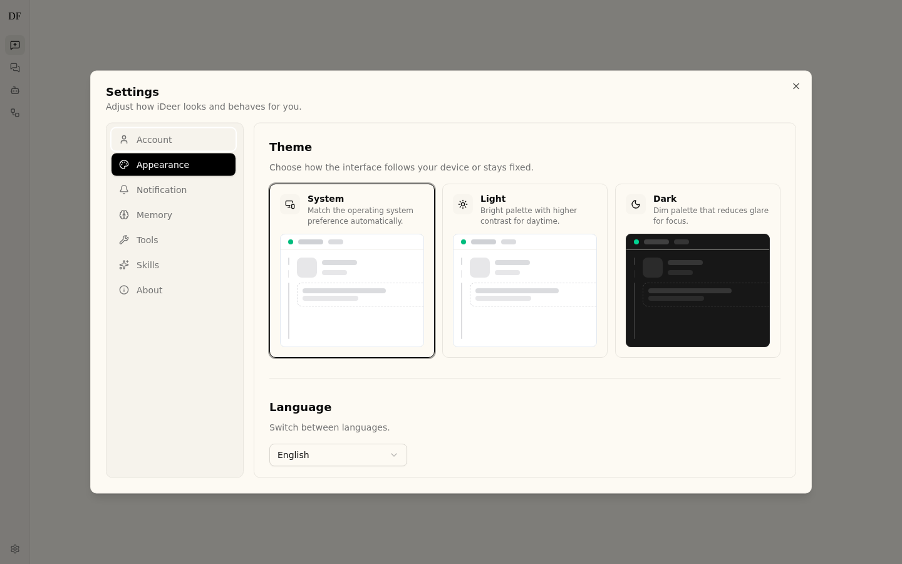

# iDeer 用户使用手册

> **版本**: v1.0 | **更新日期**: 2026-06-12

---

## 目录

- [1. 项目简介](#1-项目简介)
- [2. 快速开始](#2-快速开始)
- [3. 智能对话](#3-智能对话)
- [4. 模型与模式](#4-模型与模式)
- [5. 文件处理](#5-文件处理)
- [6. 工件管理](#6-工件管理)
- [7. 技能系统](#7-技能系统)
- [8. 智能体（Agent）](#8-智能体agent)
- [9. 工作流（Workflow）](#9-工作流workflow)
- [10. 系统设置](#10-系统设置)
- [11. 管理功能（管理员）](#11-管理功能管理员)
- [12. 快捷操作](#12-快捷操作)
- [13. 常见问题](#13-常见问题)
- [附录](#附录)

---

## 1. 项目简介

### 1.1 什么是 iDeer

iDeer 是一个企业级 AI 智能体平台，基于 LangGraph 构建，提供多模型对话、智能体编排、工作流自动化和工具扩展能力。它支持私有化部署，适用于企业内网环境。

### 1.2 核心能力概览

| 能力 | 说明 |
|------|------|
| **多模型对话** | 支持多种 LLM 模型，提供 Flash/Thinking/Pro/Ultra 四种推理模式 |
| **智能体（Agent）** | 可创建自定义 AI 助手，配置专属技能、工具和系统提示词 |
| **工作流（Workflow）** | YAML DSL 定义多步骤自动化流程，支持条件分支、并行、循环和人工审核 |
| **技能系统** | 内置公共技能 + 用户自定义技能，扩展 AI 能力边界 |
| **工具扩展** | 内置工具 + 社区工具 + MCP 服务器，支持文档解析、代码执行、数据分析 |
| **文件处理** | 支持 PDF/Word/Excel/PPT 等格式上传、解析和分析 |
| **RBAC 权限** | 四级角色权限体系（超级管理员 > 部门管理员 > 用户 > 查看者） |

### 1.3 适用场景

- **日常办公**: AI 辅助写作、翻译、总结、问答
- **代码开发**: 代码生成、审查、调试、重构
- **数据分析**: CSV/Excel 数据统计分析、可视化
- **文档处理**: PDF/Word 文档解析、信息提取
- **流程自动化**: 工作流编排、多步骤任务自动化
- **知识管理**: 企业知识库问答、记忆管理

---

## 2. 快速开始

### 2.1 访问系统

在浏览器中输入系统地址（如 `http://your-server:2026`），系统将自动跳转到登录页面。

> 💡 **提示**: 系统默认端口为 2026，具体地址请咨询系统管理员。

### 2.2 首次登录

**场景一：首次使用（无用户账号）**

1. 访问系统地址，自动跳转到 `/setup` 初始化页面
2. 输入管理员邮箱和密码（密码需至少 8 位）
3. 确认密码后点击「创建管理员账号」
4. 创建成功后自动登录进入工作空间

**场景二：已有账号**


1. 输入注册邮箱和密码
2. 点击「登录」按钮
3. 登录成功后进入工作空间欢迎页面

> ⚠️ **注意**: 如果忘记密码，请联系系统管理员重置。

### 2.3 界面导览


登录后进入工作空间，界面主要分为以下区域：

| 区域 | 说明 |
|------|------|
| **侧边栏** | 左侧导航区，包含对话列表、Agent、工作流入口和设置 |
| **聊天区** | 中间主区域，用于与 AI 对话 |
| **输入区** | 底部输入框，支持文本和文件输入 |
| **顶部栏** | 显示当前对话标题、模型/模式选择、导出按钮 |

---

## 3. 智能对话

### 3.1 发送消息


**基本操作**：

1. 在底部输入框中输入问题或指令
2. 按 `Enter` 键或点击发送按钮提交
3. AI 将以流式方式实时返回响应

**发送选项**：

| 操作 | 说明 |
|------|------|
| `Enter` | 发送消息 |
| `Shift + Enter` | 换行（不发送） |
| 点击 📎 按钮 | 附加文件 |
| 点击 ⏹ 按钮 | 停止 AI 响应 |

### 3.2 查看响应

AI 响应支持以下内容的富文本渲染：

- **Markdown 格式**: 标题、列表、代码块、表格、链接
- **代码高亮**: 支持多种编程语言的语法高亮
- **数学公式**: 支持 LaTeX 数学公式渲染
- **图片展示**: AI 生成或引用的图片

### 3.3 思维链展示


使用 Pro 或 Ultra 模式时，AI 会展示推理过程：

- **思维链面板**: 可展开/折叠查看 AI 的思考步骤
- **推理内容**: 显示 AI 的中间推理过程
- **任务分解**: 展示复杂任务的拆解步骤

> 💡 **提示**: 思维链内容会自动折叠，点击可展开查看完整推理过程。

### 3.4 后续建议


AI 响应完成后，系统会自动生成 3-5 个后续问题建议：

- 建议以标签形式显示在响应下方
- 点击建议标签自动填入输入框
- 如果输入框已有内容，系统会询问是替换还是追加

### 3.5 对话历史

- 对话自动保存，刷新页面后可继续
- 侧边栏显示所有历史对话列表
- 支持重命名和删除对话
- 对话标题由 AI 自动生成

---

## 4. 模型与模式

### 4.1 选择模型


1. 点击顶部栏的模型名称打开模型选择器
2. 搜索框支持按名称快速筛选
3. 点击模型名称切换当前对话使用的模型

> 💡 **提示**: 不同模型在推理能力、响应速度和成本上有所差异，请根据需求选择。

### 4.2 Flash 模式

- **图标**: ⚡ Zap
- **特点**: 快速响应，最小化推理开销
- **适用**: 简单问答、翻译、格式转换等轻量任务

### 4.3 Thinking 模式

- **图标**: 💡 Lightbulb
- **特点**: 中等推理深度，展示思考过程
- **适用**: 需要一定分析的问题
- **前提**: 仅对支持 `supports_thinking` 的模型可用

### 4.4 Pro 模式

- **图标**: 🎓 GraduationCap
- **特点**: 中等推理力度，深度分析
- **适用**: 复杂问题分析、代码审查、方案设计

### 4.5 Ultra 模式

- **图标**: 🚀 Rocket（金色文字样式）
- **特点**: 最高推理力度，深度思考
- **适用**: 高难度任务、架构设计、技术调研

### 4.6 推理深度控制

对于支持 `supports_reasoning_effort` 的模型，可进一步调节推理深度：

| 档位 | 说明 |
|------|------|
| Minimal | 最小推理，极速响应 |
| Low | 低推理力度 |
| Medium | 中等推理力度 |
| High | 高推理力度，深度分析 |

---

## 5. 文件处理

### 5.1 上传文件


**两种上传方式**：

1. **点击上传**: 点击输入框左侧的 📎 按钮，选择文件
2. **拖拽上传**: 将文件直接拖拽到输入框区域

**操作步骤**：

1. 选择或拖拽一个或多个文件
2. 文件出现在输入框上方的附件区域
3. 输入相关问题（如「请分析这份报告」）
4. 点击发送，AI 将自动解析文件内容

> ⚠️ **注意**:
> - macOS `.app` 包会被拒绝，建议压缩为 `.zip` 或 `.dmg` 格式
> - 文件大小受服务端配置限制

### 5.2 文件预览

上传的文件会在输入框上方显示预览卡片，包含：

- 文件名
- 文件大小
- 文件类型图标
- 删除按钮（移除附件）

### 5.3 支持的格式

| 类型 | 格式 |
|------|------|
| 文档 | PDF, Word (.docx), PowerPoint (.pptx) |
| 表格 | Excel (.xlsx), CSV |
| 代码 | .py, .js, .ts, .java, .go, .rs 等 |
| 文本 | .txt, .md, .json, .yaml, .toml |
| 图片 | .png, .jpg, .jpeg, .gif, .webp |

### 5.4 文件分析示例

```
用户: [上传 quarterly-report.pdf] 请总结这份季度报告的核心数据
AI: 根据报告分析，本季度核心数据如下：...
```

```
用户: [上传 data.csv] 这份销售数据有什么趋势？
AI: 从数据中可以看到以下趋势：...
```

---

## 6. 工件管理

### 6.1 什么是工件

工件（Artifacts）是 AI 在对话过程中生成的文件，包括代码文件、文档、技能文件等。

### 6.2 查看工件


- 当对话中生成了工件时，聊天头部出现工件按钮
- 点击按钮打开右侧工件面板
- 面板列出所有生成的文件，显示文件名和类型标签

### 6.3 下载工件

- 点击文件旁的下载按钮保存到本地
- 点击文件名可在线预览内容
- `.skill` 文件有「安装」按钮，可直接安装到技能系统

### 6.4 工件类型

| 类型 | 说明 | 示例 |
|------|------|------|
| 代码文件 | AI 生成的源代码 | `.py`, `.js`, `.ts` |
| 文档 | 生成的文档 | `.md`, `.txt` |
| 技能文件 | 可安装的技能定义 | `.skill` |
| 故障树 | 可视化故障分析图 | ReactFlow 节点图 |

---

## 7. 技能系统

### 7.1 内置技能

系统内置多个公共技能（Public Skills），涵盖常见使用场景。在设置 → 技能页面查看和管理。

### 7.2 启用/禁用技能

1. 打开设置对话框（`Cmd/Ctrl + ,`）
2. 切换到「Skills」选项卡
3. 使用开关按钮启用或禁用技能
4. 需联网的技能会显示网络标识

> ⚠️ **注意**: 启用过多技能可能影响响应速度，建议只启用需要的技能。

### 7.3 创建自定义技能

1. 在 Skills 设置页面点击「创建技能」
2. 进入技能编辑器，编写 SKILL.md 内容
3. SKILL.md 使用 YAML frontmatter + Markdown 格式：

```markdown
---
name: my-skill
description: 我的自定义技能
license: MIT
allowed-tools:
  - web_search
  - read_file
---

# 技能说明

在这里编写技能的详细指令...
```

4. 保存后技能即生效

### 7.4 安装技能包

- AI 生成的 `.skill` 文件可直接安装
- 在工件面板中点击「安装」按钮
- 安装后出现在 Custom 技能列表中

---

## 8. 智能体（Agent）

### 8.1 什么是 Agent

Agent 是具有专属配置的 AI 助手，可以拥有独立的系统提示词、工具集、技能和模型配置。适合创建专注于特定领域的 AI 助手。

### 8.2 浏览 Agent 画廊


- 访问 `/workspace/agents` 查看所有可用 Agent
- 以卡片网格形式展示，响应式布局（1-4 列）
- 每张卡片显示名称、描述和配置信息

### 8.3 创建 Agent


**创建流程**：

1. 点击 Agent 画廊的「新建 Agent」按钮
2. 输入 Agent 名称（系统会验证名称可用性）
3. 进入对话式配置页面，通过与 AI 对话来配置 Agent
4. 可配置项包括：
   - **系统提示词（SOUL）**: Agent 的人设和行为指令
   - **模型**: 使用的 LLM 模型
   - **工具集**: 可使用的工具组
   - **技能**: 启用的技能
   - **可见性**: 私有 / 部门内 / 公开

### 8.4 使用 Agent

- 在 Agent 画廊中点击 Agent 卡片进入详情页
- 点击「开始对话」与 Agent 交互
- Agent 对话使用 Agent 专属配置

### 8.5 导入/导出 Agent

- **导出**: Agent 详情页提供导出功能，导出为 `.zip` 文件
- **导入**: 在 Agent 画廊头部点击「导入」，选择 `.zip` 文件

---

## 9. 工作流（Workflow）

### 9.1 什么是工作流

工作流是基于 YAML DSL 定义的多步骤自动化流程，支持 AI Agent 调用、工具执行、条件分支、并行处理、循环迭代和人工审核。

### 9.2 浏览工作流


- 访问 `/workspace/workflows` 查看所有工作流
- 卡片展示名称、描述、版本和步骤数

### 9.3 创建工作流


**两种创建方式**：

**方式一：对话式创建**

1. 点击「新建工作流」
2. 输入工作流名称
3. 通过与 AI 对话描述需求，AI 自动生成 YAML

**方式二：YAML 编辑器**

1. 进入工作流编辑页面
2. 使用 CodeMirror 编辑器编写 YAML
3. 编辑器支持语法高亮、行号、代码折叠
4. 系统自动验证 YAML 格式

**YAML 结构示例**：

```yaml
name: data-analysis
description: 数据分析工作流
version: "1.0"
inputs:
  - name: file_path
    type: string
    required: true
    description: 数据文件路径
steps:
  - id: read_data
    type: tool
    tool: read_document
    params:
      path: "{{inputs.file_path}}"
  - id: analyze
    type: agent
    agent: data-analyst
    prompt: "分析以下数据并生成报告：{{steps.read_data.output}}"
  - id: review
    type: human_review
    message: "请审核分析报告"
    approvers:
      - role: department_admin
```

### 9.4 运行工作流


1. 在工作流详情页点击「运行」按钮
2. 在弹出的对话框中填写输入参数
3. 点击「执行」开始运行
4. 实时查看每一步的执行状态（运行中/完成/失败）

### 9.5 人工审核


工作流中可配置人工审核步骤：

- 执行到审核步骤时自动暂停
- 审核者收到审核请求
- 审核者可以批准或拒绝
- 根据审核结果决定后续流程

---

## 10. 系统设置

通过 `Cmd/Ctrl + ,` 或侧边栏菜单打开设置对话框。

### 10.1 账户设置


- 查看当前邮箱和角色
- 修改密码（需输入当前密码）
- 退出登录

### 10.2 外观设置


- **主题**: System（跟随系统）/ Light（浅色）/ Dark（深色）
- **语言**: English / 中文简体

### 10.3 通知设置

- 管理浏览器通知权限
- 启用/禁用桌面通知
- 测试通知功能
- 如果权限被拒绝，显示引导说明

### 10.4 记忆管理



- **查看模式**: 全部 / 事实 / 摘要
- **搜索**: 在所有记忆内容中搜索
- **摘要**: 只读，由 AI 自动生成的工作上下文、个人偏好等
- **事实**: 可增删改查，支持分类和置信度设置
- **导入/导出**: JSON 格式的记忆数据备份
- **清空记忆**: 需确认后清空所有记忆

### 10.5 工具配置


- 列出所有已配置的 MCP 服务器
- 显示名称、描述和启用状态
- 支持 stdio、SSE、HTTP 三种传输类型
- 可启用/禁用单个工具

### 10.6 技能管理


- **Public 选项卡**: 内置公共技能
- **Custom 选项卡**: 用户自定义技能
- 支持创建、编辑、启用/禁用和测试技能

---

## 11. 管理功能（管理员）

> ⚠️ **注意**: 以下功能仅对 `department_admin` 和 `super_admin` 角色可见。

### 11.1 管理后台概览


访问 `/workspace/admin`，管理后台显示四项统计卡片：

- 用户总数
- 部门总数
- Agent 总数
- 技能总数

每张卡片可点击跳转到对应的管理页面。

### 11.2 用户管理


- **筛选**: 按部门和角色筛选用户
- **用户卡片**: 显示用户名、部门、角色标签、禁用状态、创建时间、最后登录时间
- **角色变更**: 通过下拉菜单修改用户角色（user / department_admin / super_admin）
- **禁用用户**: 禁用后用户无法登录，需确认操作

### 11.3 部门管理


- 以卡片网格展示所有部门
- 显示部门名称、描述、成员数、Agent 数、技能数
- 支持创建、编辑和删除部门
- 删除部门需确认

### 11.4 工具管理


- 展示所有注册的工具
- 显示工具名称、分组标签、网络需求标识、描述
- 按工具组筛选
- 点击查看详情，支持 JSON 格式测试输入和在线测试

### 11.5 角色权限

| 角色 | 权限范围 |
|------|----------|
| **super_admin** | 全局管理权限，可管理所有用户、部门和资源 |
| **department_admin** | 部门级管理权限，可管理本部门用户和资源 |
| **user** | 普通用户，可创建和管理自己的对话、Agent、工作流 |
| **viewer** | 只读用户，可查看公开资源但不能创建 |

**资源可见性**：

- **私有（private）**: 仅创建者可见
- **部门内（department）**: 同部门成员可见
- **公开（public）**: 所有用户可见

---

## 12. 快捷操作

### 12.1 键盘快捷键

| 快捷键 | 功能 |
|--------|------|
| `Cmd/Ctrl + K` | 打开命令面板 |
| `Cmd/Ctrl + Shift + N` | 新建对话 |
| `Cmd/Ctrl + B` | 切换侧边栏 |
| `Cmd/Ctrl + ,` | 打开设置 |
| `Cmd/Ctrl + /` | 显示快捷键列表 |

> 💡 **提示**: macOS 使用 `Cmd` 键，Windows/Linux 使用 `Ctrl` 键。

### 12.2 命令面板


按 `Cmd/Ctrl + K` 打开命令面板：

- 搜索框支持快速筛选命令
- 显示可用命令及其快捷键
- 当前可用命令：新建对话、设置、快捷键帮助

### 12.3 对话导出


在聊天头部点击导出按钮，支持两种格式：

- **Markdown**: 包含标题、日期、消息内容的格式化文档
- **JSON**: 结构化数据，包含完整的对话元信息

> 💡 **提示**: 导出会自动过滤内部标记和系统消息。

### 12.4 分享对话

- 导出的 Markdown 文件可直接分享
- JSON 格式可用于数据迁移或备份

---

## 13. 常见问题

### 13.1 登录问题

**Q: 忘记密码怎么办？**

A: 联系系统管理员在管理后台重置密码。

**Q: 登录后显示空白页面？**

A: 尝试清除浏览器缓存，或检查网络连接是否正常。

**Q: 提示「账号已禁用」？**

A: 联系管理员确认账号状态，管理员可在用户管理中启用账号。

### 13.2 对话问题

**Q: AI 响应很慢？**

A: 
- 尝试切换到 Flash 模式以获得更快响应
- 检查网络连接
- 联系管理员确认服务端负载情况

**Q: AI 没有响应？**

A:
- 检查模型 API 密钥是否配置正确
- 查看浏览器控制台是否有错误信息
- 刷新页面重试

**Q: 对话历史丢失？**

A: 对话数据保存在服务端，如果服务重启且使用内存数据库，数据会丢失。建议配置 SQLite 或 PostgreSQL 持久化。

### 13.3 文件问题

**Q: 文件上传失败？**

A:
- 检查文件大小是否超过限制
- 确认文件格式在支持列表中
- macOS `.app` 包需先压缩为 `.zip`

**Q: AI 无法解析文件内容？**

A:
- 确认文件未损坏
- PDF 扫描件可能无法解析文字
- 尝试转换为其他格式后重新上传

### 13.4 性能问题

**Q: 页面加载缓慢？**

A:
- 检查网络带宽
- 清除浏览器缓存
- 联系管理员检查服务端资源

**Q: 工具调用超时？**

A:
- 检查工具服务是否正常运行
- 网络工具需确认网络连通性
- 联系管理员调整超时配置

---

## 附录

### A. 快捷键速查表

| 快捷键 | 功能 | 范围 |
|--------|------|------|
| `Cmd/Ctrl + K` | 命令面板 | 全局 |
| `Cmd/Ctrl + Shift + N` | 新建对话 | 全局 |
| `Cmd/Ctrl + B` | 切换侧边栏 | 全局 |
| `Cmd/Ctrl + ,` | 打开设置 | 全局 |
| `Cmd/Ctrl + /` | 快捷键帮助 | 全局 |
| `Enter` | 发送消息 | 输入框 |
| `Shift + Enter` | 换行 | 输入框 |

### B. 支持的文件格式

| 类型 | 格式 | 最大文件数 |
|------|------|-----------|
| 文档 | PDF, DOCX, PPTX | 多个 |
| 表格 | XLSX, CSV | 多个 |
| 代码 | PY, JS, TS, JAVA, GO, RS 等 | 多个 |
| 文本 | TXT, MD, JSON, YAML, TOML | 多个 |
| 图片 | PNG, JPG, JPEG, GIF, WEBP | 多个 |

### C. 支持的模型列表

系统支持多种 LLM 模型，具体可用模型取决于管理员的配置。常见模型类型：

| 类型 | 示例 | 特点 |
|------|------|------|
| 快速模型 | GPT-4o-mini, Claude Haiku | 响应快，成本低 |
| 标准模型 | GPT-4o, Claude Sonnet | 平衡性能和成本 |
| 推理模型 | o1, o3, DeepSeek-R1 | 深度推理能力 |
| 代码模型 | Claude Sonnet (code) | 代码生成优化 |

> 💡 **提示**: 可在模型选择器中查看当前可用的所有模型。

### D. 术语表

| 术语 | 说明 |
|------|------|
| **Agent** | 具有专属配置的 AI 智能体 |
| **Artifact** | AI 在对话中生成的文件（工件） |
| **Chain of Thought** | AI 的推理思维链 |
| **Flash** | 快速响应模式 |
| **MCP** | Model Context Protocol，模型上下文协议 |
| **Pro** | 深度推理模式 |
| **RBAC** | Role-Based Access Control，基于角色的访问控制 |
| **Skill** | 技能，扩展 AI 能力的指令集 |
| **SOUL** | Agent 的系统提示词（人设定义） |
| **Thread** | 对话线程 |
| **Ultra** | 最高推理力度模式 |
| **Workflow** | 工作流，多步骤自动化流程 |
